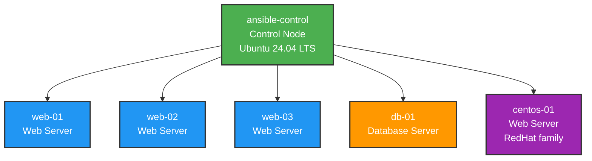
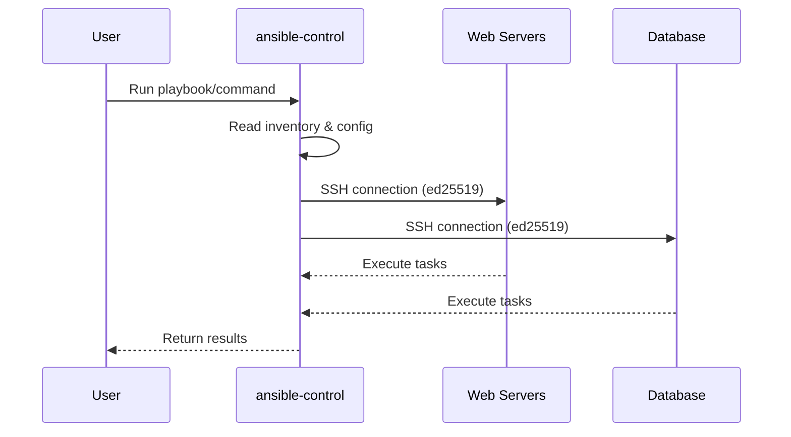
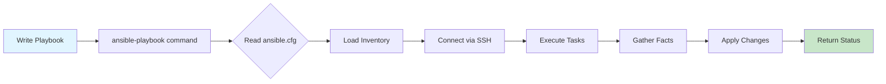
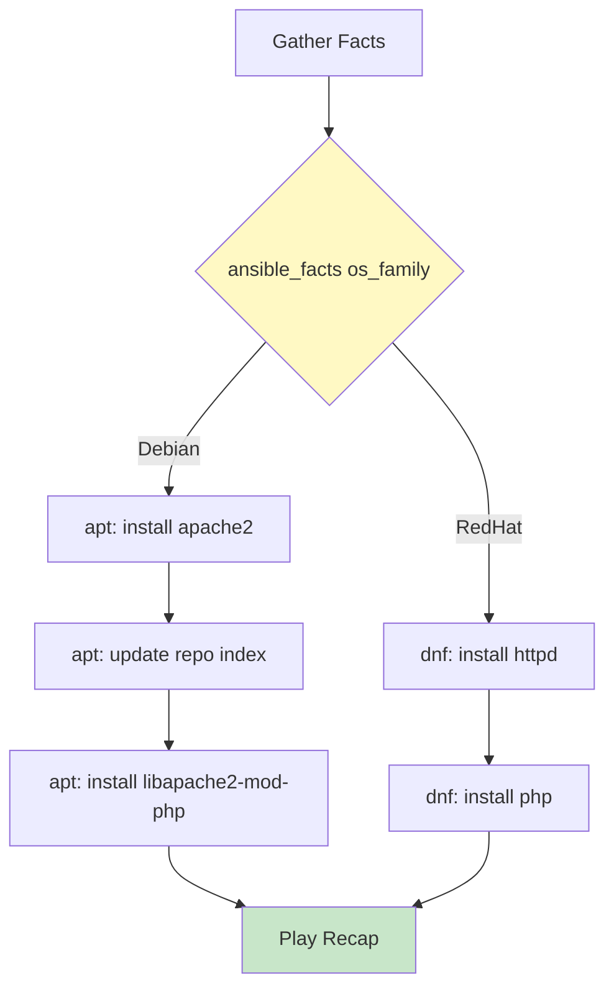
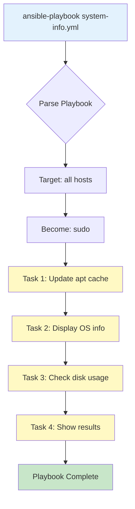

<div align="center">

# 🚀 Ansible Infrastructure Project


**Automation for Managing Web Servers & Database Infrastructure**

</div>

---

## 📋 Overview
Ansible automation for managing web servers and database infrastructure across a mixed Ubuntu 24.04 LTS (Debian family) and CentOS (RedHat family) Oracle VM fleet.

## 🛠️ Tech Stack

<p align="center">
  
  
  
  
  
  
  
  
  
</p>

---

## 🏗️ Infrastructure
- **Control Node:** ansible-control
- **Web Servers:** 🌐 web-01, web-02, web-03
- **Database:** 🗄️ db-01
- **CentOS Server:** 🎩 centos-01 (RedHat family — multi-OS branching target)
- **OS:** 🐧 Ubuntu 24.04 LTS (Debian family) + CentOS (RedHat family)
- **Ansible Version:** ⚙️ 14.1.0 (core 2.21.1)
- **Python Version:** 🐍 3.12.3

---

## 🎯 Architecture Diagram



---

## 🔄 Ansible Communication Flow



---

## 📊 Workflow: Running a Playbook



---

## 🐧 Multi-OS Package Management (`when` + `os_family`)

Playbooks branch package-manager logic by OS family rather than hardcoding distro names — scales cleanly to Rocky/Alma/Fedora without touching the `when` clause.




| File | Purpose |
|------|---------|
| `install_package_when.yml` | Early version — demonstrates a category error (distro-name `when` + wrong module) triggering a genuine task `failed` state |
| `install_package_when-2.yml` | Corrected version — branches `apt`/`dnf` tasks explicitly via `ansible_facts['os_family']` |

> **Note:** CentOS service enablement (`systemd`) and firewall rules (`ansible.posix.firewalld`) are intentionally left out of `install_package_when-2.yml` for now, to keep the Debian-vs-RedHat post-install differences visible and hand-run for learning purposes.

---

## 🧩 Variable-Driven Installs (`group_vars`)

`install_package_when-4.yml` uses the generic `ansible.builtin.package` module with OS-specific package names sourced from `group_vars`, instead of branching per task:

```yaml
- name: Install Apache and PHP
  ansible.builtin.package:
    name:
      - "{{ apache_package }}"
      - "{{ php_package }}"
    state: present
```

| Group | `apache_package` | `php_package` |
|-------|-------------------|----------------|
| webservers | apache2 | libapache2-mod-php |
| centos | httpd | php |

`remove_package.yml` uses the same pattern with `state: absent`, scoped via `--limit` for targeted cleanup.

---

## 📁 Project Structure
```
ansible/
├── .gitignore
├── ansible.cfg
├── inventories/
│   └── production/
│       ├── hosts.sample
│       ├── group_vars/
│       │   ├── webservers.yml
│       │   ├── centos.yml
│       │   └── database.yml
│       └── host_vars/
├── playbooks/
│   ├── system-info.yml
│   ├── install_package_when.yml
│   ├── install_package_when-2.yml
│   ├── install_package_when-3.yml
│   ├── install_package_when-4.yml
│   └── remove_package.yml
├── roles/
├── files/
└── templates/
```

---

# 📚 Setup Documentation

## 🔐 SSH Key Configuration for Ansible

### Create SSH Keys
```bash
ssh-keygen -t ed25519 -C "your_comment"

# Creates:
#    ~/.ssh/id_ed25519      # Private key
#    ~/.ssh/id_ed25519.pub  # Public key
```

### Copy Public Key to Managed Nodes
```bash
ssh-copy-id -i ~/.ssh/id_ed25519.pub <username>@<host>
```

Repeat for all managed nodes.

### Verify Password-less SSH
```bash
ssh <username>@<host>
```

---

## 📦 Git Configuration

### Install Git
```bash
sudo apt update && sudo apt install git -y
git --version
```

### Setup SSH Keys for Git
Copy existing Git SSH keys to `~/.ssh/` or create new ones (use different keys than Ansible SSH keys):

```bash
chmod 600 ~/.ssh/<your_git_private_key>
chmod 644 ~/.ssh/<your_git_public_key>
```

### Configure SSH for GitHub
```bash
vim ~/.ssh/config
```

Add:
```
Host github.com
    HostName github.com
    User git
    IdentityFile ~/.ssh/<your_git_private_key>
```

### Configure Git Identity
```bash
git config --global user.name "Your Name"
git config --global user.email "your_email@example.com"
```

### Verify Configuration
```bash
git config --list
ssh -T git@github.com
```

### Initialize Git Repository
```bash
mkdir ~/ansible && cd ~/ansible
git init
git status
```

### Create .gitignore
```bash
touch .gitignore
```

---

## ⚙️ Ansible Installation & Setup

### Step 1: Install Ansible (via pipx)
```bash
sudo apt update
sudo apt install pipx -y
pipx ensurepath
pipx install --include-deps ansible
source ~/.bashrc
ansible --version
```

### Step 2: Create Directory Structure
```bash
cd ~/ansible

mkdir -p inventories/production/{group_vars,host_vars}
mkdir -p roles playbooks files templates

# Verify
tree -L 3
```

### Step 3: Create Inventory File
```bash
vim inventories/production/hosts
```

Add (replace placeholders with your actual values):
```ini
[webservers]
web-01 ansible_host=<IP_ADDRESS>
web-02 ansible_host=<IP_ADDRESS>
web-03 ansible_host=<IP_ADDRESS>

[database]
db-01 ansible_host=<IP_ADDRESS>

[all:vars]
ansible_user=<your_username>
ansible_ssh_private_key_file=~/.ssh/id_ed25519
ansible_python_interpreter=/usr/bin/python3
```

### Step 4: Create Ansible Configuration
```bash
vim ansible.cfg
```

Add:
```ini
[defaults]
inventory = ./inventories/production/hosts
host_key_checking = False
remote_user = <your_username>
private_key_file = ~/.ssh/id_ed25519
retry_files_enabled = False
gathering = smart
fact_caching = jsonfile
fact_caching_connection = /tmp/ansible_facts
fact_caching_timeout = 3600
nocows = 1

[privilege_escalation]
become = True
become_method = sudo
become_user = root
become_ask_pass = False

[ssh_connection]
pipelining = True
ssh_args = -o ControlMaster=auto -o ControlPersist=60s
```

### Step 5: Configure Passwordless Sudo on All Managed Hosts
SSH to each VM and run:
```bash
ssh <username>@<host>
echo "$USER ALL=(ALL) NOPASSWD:ALL" | sudo tee /etc/sudoers.d/$USER
sudo chmod 0440 /etc/sudoers.d/$USER
exit
```
Repeat for all managed hosts.

### Step 6: Test Connectivity
```bash
# Verify configuration
ansible --version

# List hosts
ansible all --list-hosts

# Accept host keys
ssh-keyscan <host1-ip> <host2-ip> <host3-ip> <host4-ip> >> ~/.ssh/known_hosts

# Test ping
ansible all -m ping

# Test groups
ansible webservers -m ping
ansible database -m ping
```

### Step 7: Test Ad-hoc Commands
```bash
# Check uptime
ansible all -a "uptime"

# Check disk space
ansible all -a "df -h"

# Check memory
ansible all -a "free -h"

# Verify sudo access
ansible all -b -a "whoami"
```

### Step 8: Install Packages
```bash
ansible webservers -b -m apt -a "name=vim state=present"
ansible webservers -b -m apt -a "name=tree state=present"
```

### Step 9: Install Ansible Collections (Optional)
```bash
ansible-galaxy collection install community.general
ansible-galaxy collection install ansible.posix
ansible-galaxy collection install community.mysql

# List collections
ansible-galaxy collection list
```

### Step 10: Create First Playbook
```bash
vim playbooks/system-info.yml
```

Add:
```yaml
---
- name: Gather System Information
  hosts: all
  become: yes
  tasks:
    - name: Update apt cache
      apt:
        update_cache: yes
        cache_valid_time: 3600
      
    - name: Display OS information
      debug:
        msg: |
          Hostname: {{ ansible_facts['hostname'] }}
          OS: {{ ansible_facts['distribution'] }} {{ ansible_facts['distribution_version'] }}
          IP: {{ ansible_facts['default_ipv4']['address'] }}
          
    - name: Check disk usage
      shell: df -h /
      register: disk_usage
      
    - name: Show disk usage
      debug:
        var: disk_usage.stdout_lines
```

Run playbook:
```bash
ansible-playbook playbooks/system-info.yml
```

---

## 🔁 Playbook Execution Flow



---

## 📖 Quick Reference

| Command | Description |
|---------|-------------|
| `ansible all -m ping` | Test connectivity |
| `ansible all --list-hosts` | List managed hosts |
| `ansible-playbook playbook.yml` | Run playbook |
| `ansible-playbook playbook.yml --check` | Dry run |
| `ansible-playbook playbook.yml -v` | Verbose output |
| `ansible-inventory --list` | Show inventory |
| `ansible-doc <module>` | Module documentation |
| `ansible all -a "command"` | Run ad-hoc command |
| `ansible-lint playbook.yml --profile production` | Lint against strictest rule profile |

---

## 🔒 Security Notes
- ⚠️ Real inventory file (`inventories/production/hosts`) is gitignored
- 🔑 Never commit private SSH keys
- 🔐 Never commit passwords or sensitive data
- 🔰 Use Ansible Vault for secrets
- 🔀 Use separate SSH keys for Ansible and Git

---

## 📝 Notes
Personal learning and development project

---

<div align="center">

**Made with ❤️ using Ansible**


</div>

---

