<div align="center">

# 🚀 Ansible Infrastructure Project


**Automation for Managing Web Servers & Database Infrastructure**

</div>

---

## 📋 Overview
Ansible automation for managing web servers and database infrastructure across a mixed Ubuntu 24.04 LTS (Debian family) and CentOS (RedHat family) Oracle VM fleet.

## 🛠️ Tech Stack

<p align="center">
  
  
  
  
  
  
  
  
  
  
  
</p>

---

## 🏗️ Infrastructure
- **Control Node:** ansible-control
- **Web Servers:** 🌐 web-01, web-02, web-03
- **Database:** 🗄️ db-01
- **CentOS Server:** 🎩 centos-01 (RedHat family — multi-OS branching target)
- **OS:** 🐧 Ubuntu 24.04 LTS (Debian family) + CentOS (RedHat family)
- **Ansible Version:** ⚙️ 14.1.0 (core 2.21.1)
- **Python Version:** 🐍 3.12.3

> **Note:** `db-01` is inventory-only at this stage — no database playbooks exist yet. It currently appears in the codebase mainly as the target of a host-scope bug fix (see `07-remove_package.yml`), not as a managed service. Database automation (MySQL/PostgreSQL role, `community.mysql`) is on the roadmap, not yet built.

---

## 🎯 Architecture Diagram

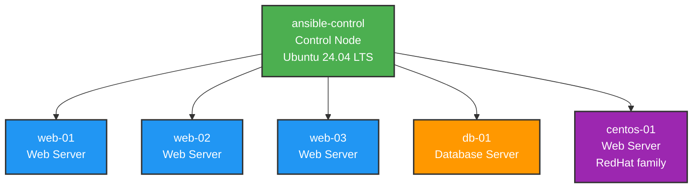
```mermaid
graph TB
    A[ansible-control<br/>Control Node<br/>Ubuntu 24.04 LTS] --> B[web-01<br/>Web Server]
    A --> C[web-02<br/>Web Server]
    A --> D[web-03<br/>Web Server]
    A --> E[db-01<br/>Database Server]
    A --> F[centos-01<br/>Web Server<br/>RedHat family]
    
    style A fill:#4CAF50,stroke:#333,stroke-width:2px,color:#fff
    style B fill:#2196F3,stroke:#333,stroke-width:2px,color:#fff
    style C fill:#2196F3,stroke:#333,stroke-width:2px,color:#fff
    style D fill:#2196F3,stroke:#333,stroke-width:2px,color:#fff
    style E fill:#FF9800,stroke:#333,stroke-width:2px,color:#fff
    style F fill:#9C27B0,stroke:#333,stroke-width:2px,color:#fff
```

---

## 🔄 Ansible Communication Flow

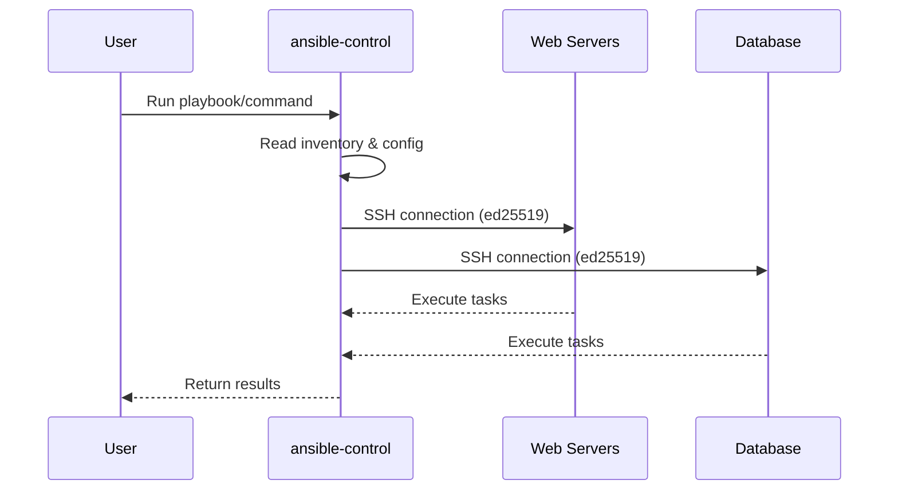
```mermaid
sequenceDiagram
    participant User
    participant Control as ansible-control
    participant Web as Web Servers
    participant DB as Database

    User->>Control: Run playbook/command
    Control->>Control: Read inventory & config
    Control->>Web: SSH connection (ed25519)
    Control->>DB: SSH connection (ed25519)
    Web-->>Control: Execute tasks
    DB-->>Control: Execute tasks
    Control-->>User: Return results
```

---

## 📊 Workflow: Running a Playbook

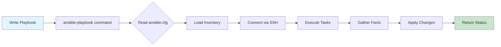
```mermaid
flowchart LR
    A[Write Playbook] --> B[ansible-playbook command]
    B --> C{Read ansible.cfg}
    C --> D[Load Inventory]
    D --> E[Connect via SSH]
    E --> F[Execute Tasks]
    F --> G[Gather Facts]
    G --> H[Apply Changes]
    H --> I[Return Status]
    
    style A fill:#e1f5ff
    style I fill:#c8e6c9
```

---

## 🐧 Multi-OS Package Management (`when` + `os_family`)

Playbooks branch package-manager logic by OS family rather than hardcoding distro names — scales cleanly to Rocky/Alma/Fedora without touching the `when` clause.

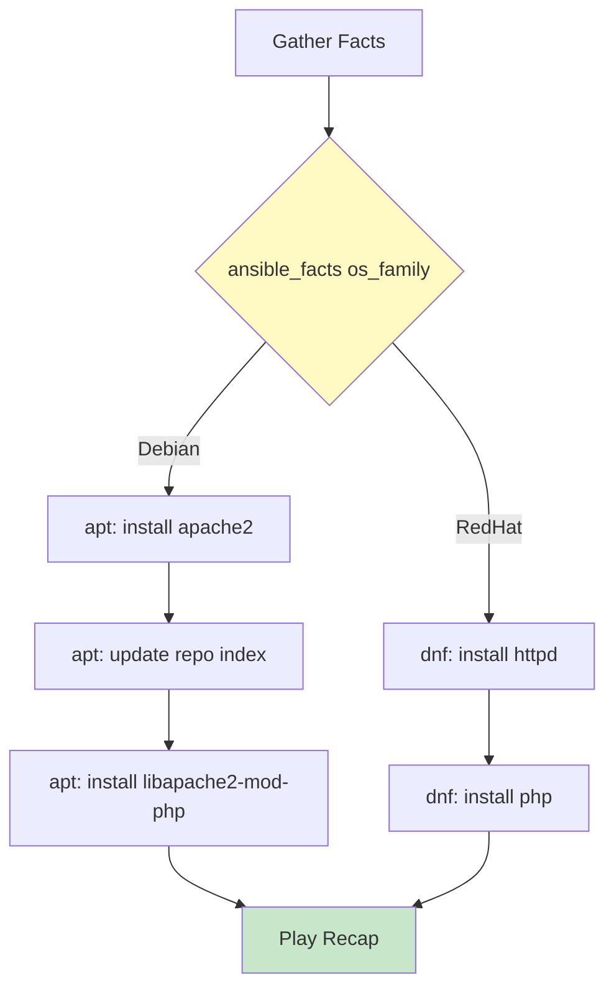
```mermaid
flowchart TD
    A[Gather Facts] --> B{ansible_facts os_family}
    B -->|Debian| C[apt: install apache2]
    B -->|RedHat| D[dnf: install httpd]
    C --> E[apt: update repo index]
    D --> F[dnf: install php]
    E --> G[apt: install libapache2-mod-php]
    G --> H[Play Recap]
    F --> H
    
    style B fill:#fff9c4
    style H fill:#c8e6c9
```


| File | Purpose |
|------|---------|
| `03-install_package_when-1.yml` | Early version — demonstrates a category error (distro-name `when` + wrong module) triggering a genuine task `failed` state |
| `04-install_package_when-2.yml` | Corrected version — branches `apt`/`dnf` tasks explicitly via `ansible_facts['os_family']` |

> **Note:** CentOS service enablement (`systemd`) and firewall rules (`ansible.posix.firewalld`) are intentionally left out of `04-install_package_when-2.yml` for now, to keep the Debian-vs-RedHat post-install differences visible and hand-run for learning purposes.

---

## 🧩 Variable-Driven Installs (`group_vars`)

`06-install_package_when-4.yml` uses the generic `ansible.builtin.package` module with OS-specific package names sourced from `group_vars`, instead of branching per task:

```yaml
- name: Install Apache and PHP
  ansible.builtin.package:
    name:
      - "{{ apache_package }}"
      - "{{ php_package }}"
    state: present
```

| Group | `apache_package` | `php_package` |
|-------|-------------------|----------------|
| webservers | apache2 | libapache2-mod-php |
| centos | httpd | php |

**How `group_vars` actually resolves** — a host's group membership decides which file wins:

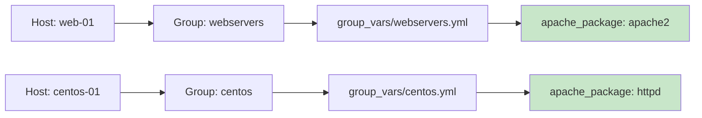
```mermaid
flowchart LR
    A[Host: web-01] --> B[Group: webservers]
    B --> C[group_vars/webservers.yml]
    C --> D["apache_package: apache2"]

    E[Host: centos-01] --> F[Group: centos]
    F --> G[group_vars/centos.yml]
    G --> H["apache_package: httpd"]

    style D fill:#c8e6c9
    style H fill:#c8e6c9
```

`07-remove_package.yml` uses the same pattern with `state: absent`, scoped via `hosts: webservers:centos` for targeted cleanup — a fix for a real bug worth visualizing, since it's an easy distinction to get wrong:

**`hosts:` selects the target set. `when:` only filters *within* that set — it can't remove a host `hosts:` already included.**

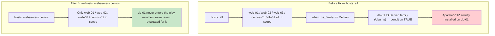
```mermaid
flowchart TD
    subgraph Before["Before fix — hosts: all"]
        A1[hosts: all] --> B1[web-01 / web-02 / web-03 / centos-01 / db-01 all in scope]
        B1 --> C1["when: os_family == Debian"]
        C1 --> D1["db-01 IS Debian family (Ubuntu) → condition TRUE"]
        D1 --> E1["Apache/PHP silently installed on db-01"]
    end

    subgraph After["After fix — hosts: webservers:centos"]
        A2["hosts: webservers:centos"] --> B2["Only web-01 / web-02 / web-03 / centos-01 in scope"]
        B2 --> C2["db-01 never enters the play — when: never even evaluated for it"]
    end

    style E1 fill:#ffcdd2
    style C2 fill:#c8e6c9
```

This is exactly why `db-01` had Apache/PHP silently installed on it since Day 3 — `when:` was doing its job correctly, `hosts: all` was the actual bug.

---

## 🌐 Templates, Handlers & Virtual Hosts

Playbooks 09–11 move past package management into actually serving content: static file deploy → Jinja2 templating → a full Apache virtual-host lifecycle with config validation. This is the most involved part of the repo so far.

**Handler collapse** — four separate tasks `notify` the same handler; Ansible fires it once per play run, not four times:

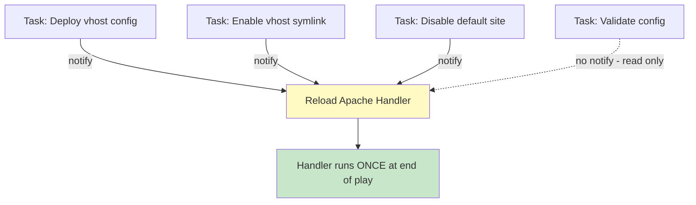
```mermaid
flowchart TD
    A[Task: Deploy vhost config] -->|notify| E[Reload Apache Handler]
    B[Task: Enable vhost symlink] -->|notify| E
    C[Task: Disable default site] -->|notify| E
    D[Task: Validate config] -.->|no notify - read only| E
    E --> F[Handler runs ONCE at end of play]

    style E fill:#fff9c4
    style F fill:#c8e6c9
```

### `09-install_package_when-tags-site-1.yml` — Static deploy (`copy`)
Static `site-1.html` pushed as-is via `ansible.builtin.copy` — same bytes on every host, only the hostname differs because it's baked into the file per the group it targets.

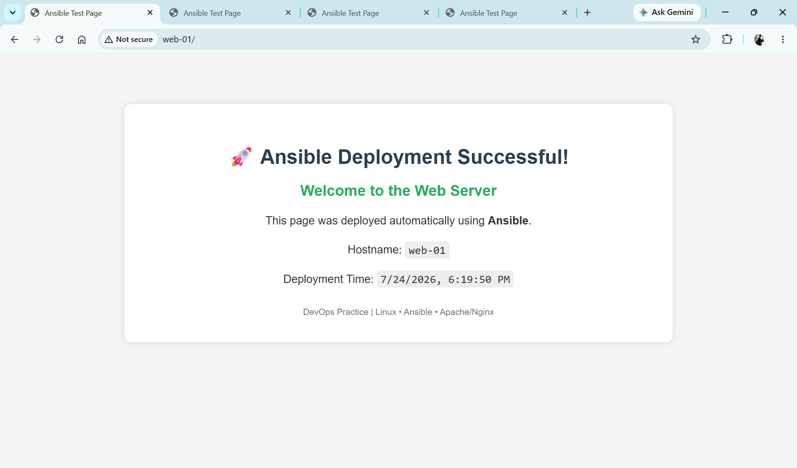

<details>
<summary>web-02, web-03, centos-01</summary>

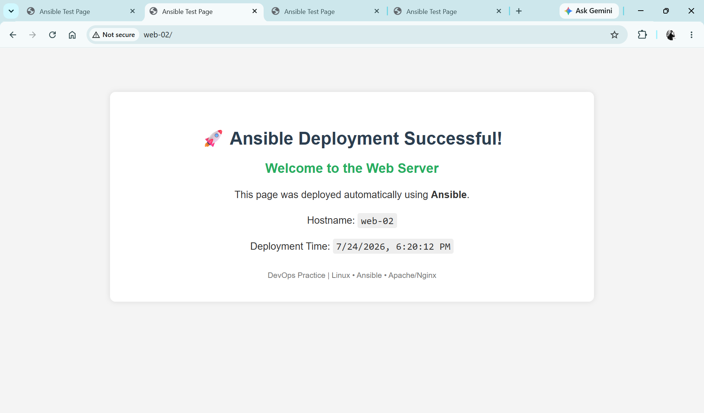
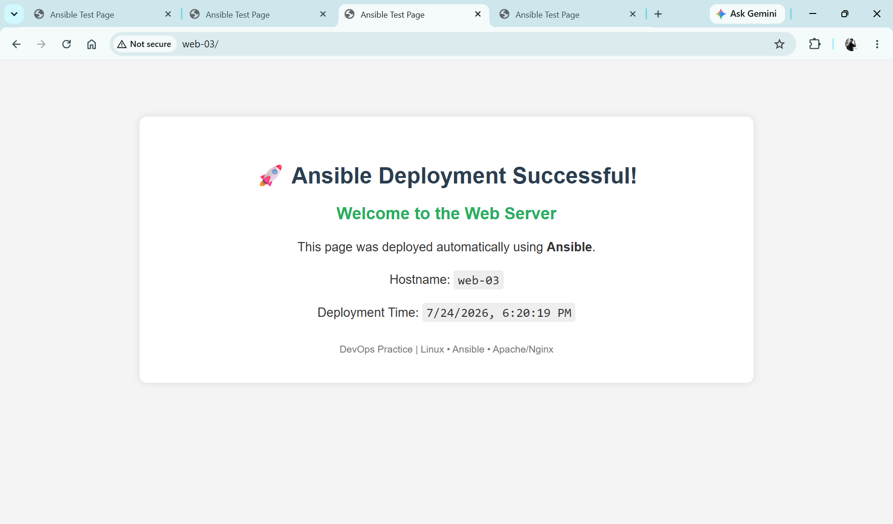
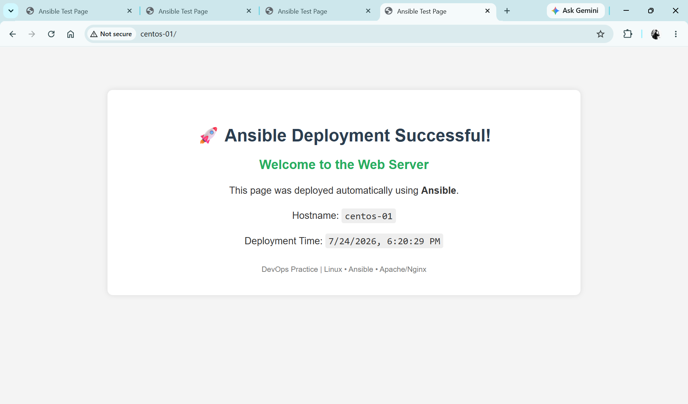

</details>

### `10-install_package_template-site-1.yml` — Jinja2 rendering (`template`)
Swaps `copy` for `ansible.builtin.template` — `dashboard.html.j2` rendered per-host from live `ansible_facts` (hostname, OS, kernel, memory, vCPUs), not hardcoded.


<details>
<summary>web-02, web-03, centos-01</summary>

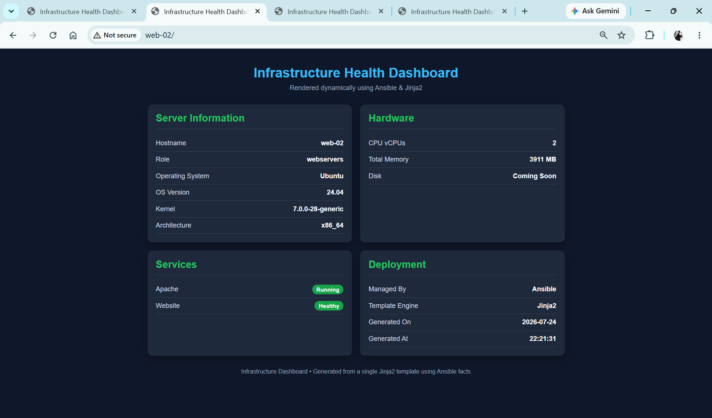


</details>

### `11-apache-virtual-host-1.yml` — Virtual host deploy
Full vhost deployment: `ansible.builtin.file` (`directory`/`link`/`absent`), `handlers`/`notify`, config validation (`apache2ctl configtest` / `httpd -t`) before reload. Same dashboard content, now served through a dedicated vhost instead of the default site — visually identical to stage 10 by design, which is exactly what a config-validation step is supposed to prove (the migration didn't break anything).

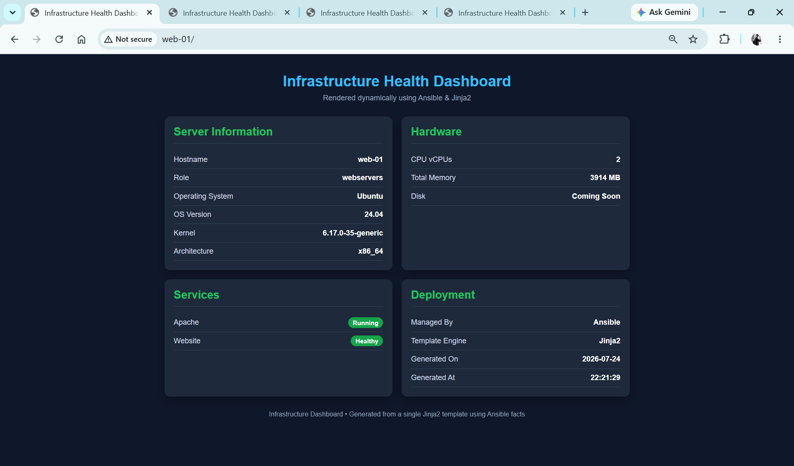

<details>
<summary>web-02, web-03, centos-01</summary>


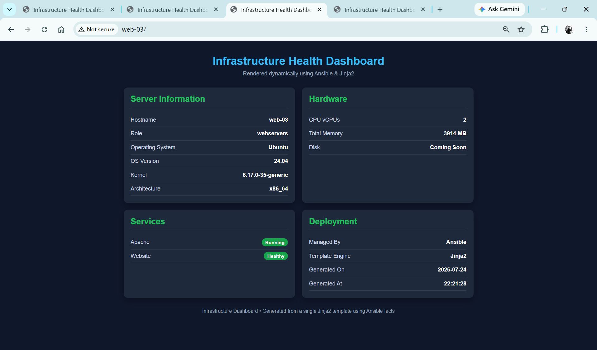
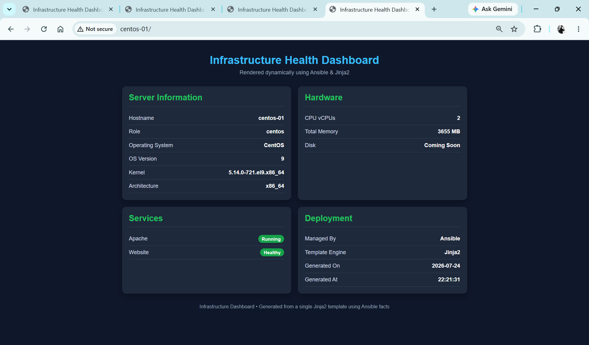

</details>

> **Real bugs hit building this (not hypothetical):**
> - `ansible.builtin.file` with `state: link` refused to create a symlink to a target that didn't exist yet — fixed with `force: true`
> - A vhost template put `ServerTokens`/`ServerSignature` inside `<VirtualHost>` — Apache's config grammar rejects both directives at that scope. Caught by an explicit `configtest` validation task (`changed_when: false`) before the reload, not by a broken page later
> - The original template used Debian's `${APACHE_LOG_DIR}` env var for log paths — broke on centos-01 since `httpd` has no equivalent. Fixed by moving `apache_log_dir` into `group_vars` (`/var/log/apache2` vs `/var/log/httpd`) instead of relying on an Apache-internal, OS-specific variable — same pattern as the package-name and service-name branching above, just one layer deeper

---

## 📁 Project Structure
```
.
├── ansible.cfg
├── COMMANDS.md
├── docs/
│   └── screenshots/
│       ├── pb-09/
│       ├── pb-10/
│       └── pb-11/
├── files/
│   └── site-1.html
├── inventories/
│   └── production/
│       ├── hosts.sample
│       ├── group_vars/
│       └── host_vars/
├── playbooks/
│   ├── 01-system-info.yml
│   ├── 02-install_package.yml
│   ├── 03-install_package_when-1.yml
│   ├── 04-install_package_when-2.yml
│   ├── 05-install_package_when-3.yml
│   ├── 06-install_package_when-4.yml
│   ├── 07-remove_package.yml
│   ├── 08-install_package_when-tags-5.yml
│   ├── 09-install_package_when-tags-site-1.yml
│   ├── 10-install_package_template-site-1.yml
│   └── 11-apache-virtual-host-1.yml
├── README.md
├── roles/
├── SETUP.md
└── templates/
    ├── dashboard.html.j2
    └── infrastructure-dashboard.conf.j2
```

---

## 🧭 How to Follow This Project

Playbooks are numbered in build order — each one builds on a concept introduced by the last. Read/run them in sequence to follow the actual learning path:

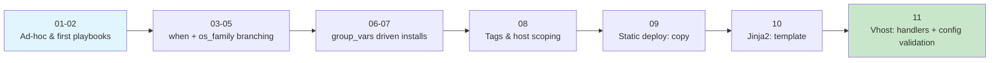
```mermaid
flowchart LR
    A["01-02<br/>Ad-hoc & first playbooks"] --> B["03-05<br/>when + os_family branching"]
    B --> C["06-07<br/>group_vars driven installs"]
    C --> D["08<br/>Tags & host scoping"]
    D --> E["09<br/>Static deploy: copy"]
    E --> F["10<br/>Jinja2: template"]
    F --> G["11<br/>Vhost: handlers + config validation"]

    style A fill:#e1f5ff
    style G fill:#c8e6c9
```

| # | Playbook | Concept introduced |
|---|----------|---------------------|
| 01 | `system-info.yml` | First playbook — `apt` cache update, fact-based `debug`, `register` + `shell` |
| 02 | `install_package.yml` | Basic package management with `apt`/`package` |
| 03 | `install_package_when-1.yml` | `when` conditionals — intentional category error (distro-name match + wrong module) to observe a real task `failed` state |
| 04 | `install_package_when-2.yml` | Corrected multi-OS branching via `ansible_facts['os_family']` |
| 05 | `install_package_when-3.yml` | Consolidated apt/dnf tasks per OS family (list-form package names) |
| 06 | `install_package_when-4.yml` | Generic `ansible.builtin.package` module driven by `group_vars` |
| 07 | `remove_package.yml` | Same `group_vars` pattern with `state: absent` — cleanup for a host-scope leak (see Known Weak Spots in progress log) |
| 08 | `install_package_when-tags-5.yml` | Tags — `tags:`, `--tags`, `--skip-tags`, multi-play host scoping |
| 09 | `install_package_when-tags-site-1.yml` | Static file deployment via `ansible.builtin.copy` |
| 10 | `install_package_template-site-1.yml` | `ansible.builtin.template` — Jinja2 rendering driven by live `ansible_facts` |
| 11 | `apache-virtual-host-1.yml` | Full vhost deployment — `handlers`/`notify`, `file` module (`directory`/`link`/`absent`), config validation (`apache2ctl configtest` / `httpd -t`), cross-OS `group_vars` for log paths |

**Supporting directories** (foundational, not sequential steps):
- `files/` — static assets deployed as-is (`site-1.html`, used by playbook 09)
- `templates/` — Jinja2 templates rendered per-host (`dashboard.html.j2` used by 10; `infrastructure-dashboard.conf.j2` used by 11)
- `inventories/production/group_vars/` — per-group variables (package names, log paths, vhost paths) driving playbooks 06 and 11
- `inventories/production/host_vars/` — scaffolded, not yet in active use
- `roles/` — scaffolded, not yet in active use

---

## 📚 Documentation

- **[SETUP.md](./SETUP.md)** — one-time environment bootstrap: SSH keys, Git config, Ansible install, inventory, `ansible.cfg`, passwordless sudo, connectivity check
- **[COMMANDS.md](./COMMANDS.md)** — day-to-day command reference: ad-hoc commands, collections, playbook execution flags, quick reference table

---

## 🔒 Security Notes
- ⚠️ Real inventory file (`inventories/production/hosts`) is gitignored
- 🔑 Never commit private SSH keys
- 🔐 Never commit passwords or sensitive data
- 🔰 Use Ansible Vault for secrets
- 🔀 Use separate SSH keys for Ansible and Git

---

## 📝 Notes
Personal learning and development project

---

<div align="center">

**Made with ❤️ using Ansible**


</div>

---
